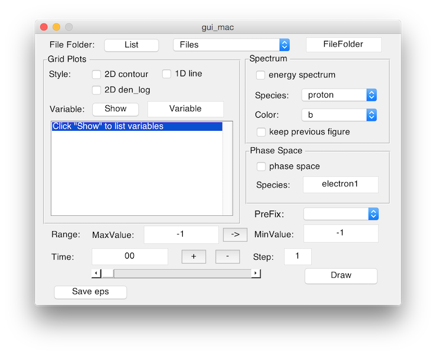

Matlab GUI for datafile
========================

A Matlab GUI used to generate figures from SDF data files.

###What

Every time generating a figure from a SDF file, a long command with many parameters and file names are needed to type in the command window without any mistakes. Such a business is boring and takes a lot of time doing repeating works.

The goal of this program is to give a graphic user interface to the users, which will get people out of the long command typing business. Using only a mouse pointer to generate figures by selecting or listing different parameters.

Now, this script is only for 2D datafiles. If you want to analyze 1D or 3D datafiles, you can modify the source file on your own.

###How

To get started, put this folder along with your datafile folders.

Start Matlab and change work directory to this folder.

Type "gui_win" to start the GUI program under windows.

Type "gui_mac" to start the GUI program under Mac OS X.

Type "gui_linux" to start the GUI program under Linux.

Click "list" button to list folders.

Select a folder which you like to analyze.

Click "show" to show variables. It depend on the bottom "time" bar.

Move "time" bar to your time.

Select plotting styles and click "draw".

The files being saved is at '../pic' folder by default in windows version (so you need to mkdir before saving) and show a window to let you choose in OS X and Linux versions.

###Description of the source files

cut.m is used to plot a 1D line figure.

draw.m is used to plot a  2D contour plot figure.

den_log.m is used to plot a  2D contour plot figure in log10.

en.m is used to plot a energy spectrum figure.

seps.m is used to save figures in 'eps' or 'pdf' formats.

lv.m is used to list variables in the selected datafile.

gd.m is used to read the datafile.

x_px is used to plot phase space.

###Finally

This program is under programming and unfinished. Welcome to tell me the bugs and help me to improve this program.
